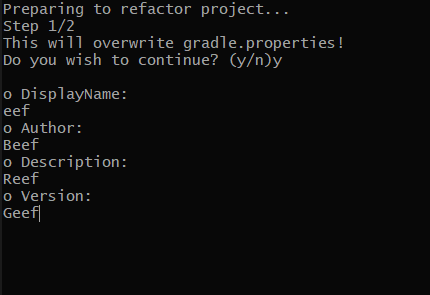

# FoxLoader Sample Project
The focus here is [this bash file](refactor.sh), it's a very basic wizard that helps start a project without needing a ton of manual refactoring. (Btw if there's a way easier way of doing it then tell me please)

Be careful not to delete work you already have, it might be a little volatile.

Pro-tip: look at the code you download from online, just in case.

Clone this project or download the zip, then run [script](refactor.sh), enter info about the project, all the fields have the default [values](gradle.properties) of this project.

